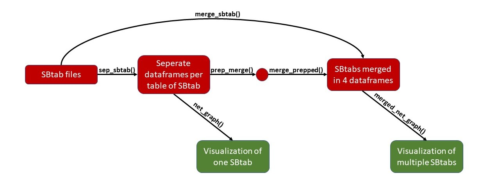

<!-- README.md is generated from README.Rmd. Please edit that file -->

```{r, include = FALSE}
knitr::opts_chunk$set(
  collapse = TRUE,
  message = FALSE,
  warning = FALSE,
  fig.path = "man/figures/README-",
  out.width = "100%"
)
```

# Package ONTOX
## For merging and visualizing SBtab files

The functions within this package can be used to merge and visualize SBtab files as provided by the SysRev platform. It has originally been made as part of a Data Science project for the University of Applied Sciences in Utrecht.

## Installation

The development version of PackageONTOX can be installed from [GitHub](https://github.com/) by using:

``` r
# install.packages("devtools")
devtools::install_github("ProjecticumDataScience/Package_ONTOX")
```

# Contents

The package currently contains the following functions:
<ul><li>Merging:<ul>
<li>sep_sbtab</li>
<li>prep_merge</li>
<li>merge_prepped</li>
<li>merge_sbtab</li></ul>
<li>Visualizations:<ul>
<li>net_graph</li>
<li>merged_net_graph</li></ul></ul>

Together they create a possible workflow as described in figure 1. 



The package also contains a variety of data files:

## [Raw data](https://github.com/ProjecticumDataScience/Package-ONTOX/data-raw) 

This consists of four SBtab files in the .tsv format. These have been provided by M. Teunis from University of Applied Sciences Utrecht and were a product of the SysRev platform. In figure 1 this would be the 'SBtab files' at the start of the process.

The raw data folder also contains the R scripts used to create the following edited data files.

## [Data](https://github.com/ProjecticumDataScience/Package-ONTOX/data)

The data folder contains three types of files. 

The filenames starting with *physmap* are the original SBtab files seperated into four dataframes using the sep_sbtab function. Each dataframe is placed in a folder corresponding with the type of data it provided within the SBtab file (incl. compartments, edges, reactions, species and full). In figure 1 these are the 'Separate dataframes per table of SBtab'. 

Within these same folders are the files with names starting with *prepped*. These are the same dataframes except they have been prepped for merging using the prep_merge function. In figure 1 these are not named but represented by the dot connecting the prep_merge function to the merge_prepped function.

Lastly, in the *merged* folder are the merged files per dataframe, created with either the merge_prepped or merge_sbtab functions. In figure 1 these are the 'SBtabs merged in 4 dataframes'. Aside from the files being the input and ouput for the merging functions, they are also used by the visualization functions as shown below.

# Functions

```{r library}

library(PackageONTOX)

```

## sep_sbtab

To be added.

## prep_merge

To be added.

## merge_prepped

To be added.

## merge_sbtab

To be added.

## net_graph

After separating the SBtab file into various parts, the edges, species and compartments list will be used to generate a network graph of a single file. The function alters the data as fitting and converts it into a object suitable for the graph. The graph is pre-set with a fitting lay-out, edges that direct which way the reaction is headed, nodes that are colored based on where they are found in the cell/body and names of the involved substances.

```{r net graph example, eval = FALSE}

net_graph("data/physmap6_edges.rds", "data/physmap6_species.rds", "data/physmap6_compartments.rds")

```

## merged_net_graph

This function is mostly similar to the net_graph function. The difference is that this function is used after merging multiple SBtab files. Therefore the edges, species and compartments lists of the merged files will be used to create a network graph of multiple files merged together. An addition to this function is that the shape of the nodes represent the original files.

```{r merged net graph example, eval = FALSE}

merged_net_graph("data/merged/merged_physmap789_edges.rds", "data/merged/merged_physmap789_species.rds", "data/merged/merged_physmap789_compartments.rds")

```
