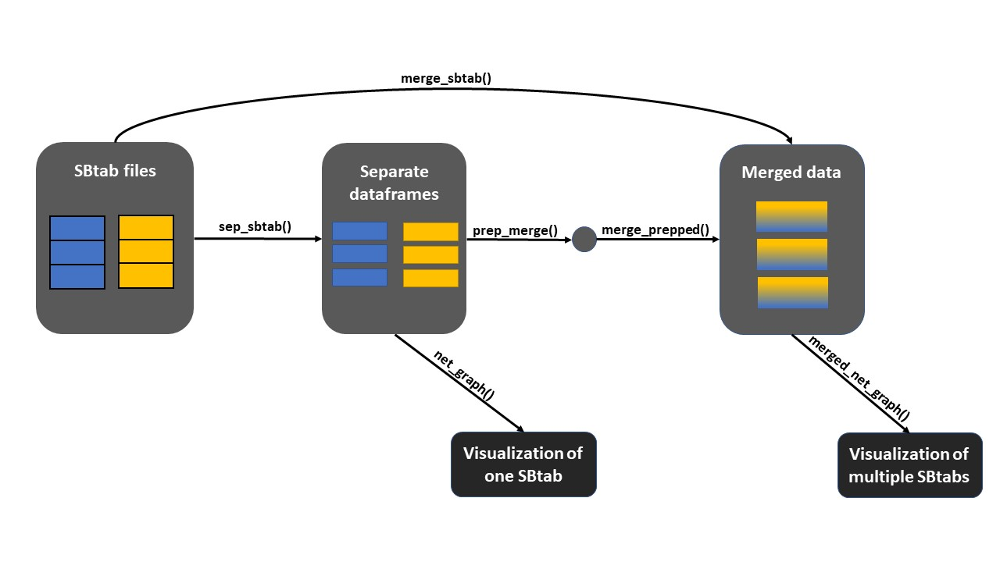
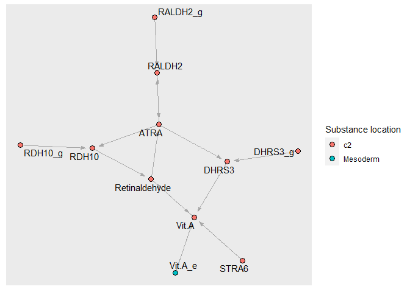
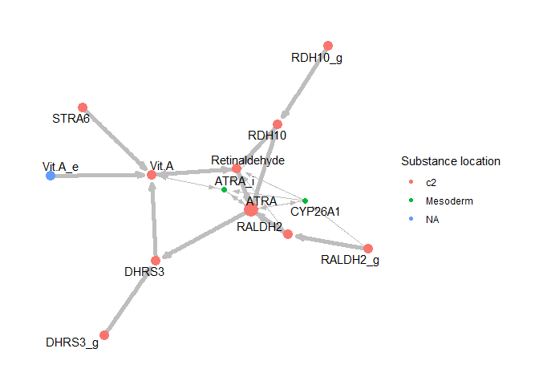

```{r, include = FALSE}
knitr::opts_chunk$set(
  collapse = TRUE,
  message = FALSE,
  warning = FALSE,
  fig.path = "figures/"
)
```

# Package ONTOX
## For merging and visualizing SBtab files

The functions within this package can be used to merge and visualize SBtab files as provided by the SysRev platform. It has originally been made as part of a Data Science project for the University of Applied Sciences in Utrecht.

## Installation

The development version of sbtabr can be installed from [GitHub](https://github.com/) by using:

``` r
# install.packages("devtools")
devtools::install_github("ProjecticumDataScience/sbtabr")
```

# Contents

The package currently contains the following functions:
<ul><li>Merging:<ul>
<li>sep_sbtab</li>
<li>prep_merge</li>
<li>merge_prepped</li>
<li>merge_sbtab</li></ul>
<li>Visualizations:<ul>
<li>net_graph</li>
<li>merged_net_graph</li></ul></ul>

Together they create a possible workflow as described in figure 1. 

{width='650px' fig.align='center'}
*Figure 1. The workflow and usage process of the seperate functions. Each function creates an output which can be used for another function.*

The package also contains a variety of data files:

## [External data](https://github.com/ProjecticumDataScience/sbtabr/inst/extdata) 

All files used as examples are stored in inst/extdata/. This includes the following:
<ul><li> 4 .tsv files containing the original SBtab's as provided by University of Applied Sciences Utrecht.</li>
<li> 3 .rds files starting with physmap6_*. These were acquired using the sep_sbtab function. </li>
<li> 2 .rds files starting with prepped_*. These were acquired using the prep_merge function. </li>
<li> 6 .rds files starting with merged_*. These were aquired using the merge_sbtab function. </li></ul>

Aside from the files being the input and ouput for the merging functions, they are also used by the visualization functions as shown below. The filepaths will be turned into values with the corresponding filename to keep the examples later on more clear.

```{r filepaths}
library(sbtabr)

# Example files for sep_sbtab and merge_sbtab
physmap6 <- system.file("extdata", "physmap6.tsv", package="sbtabr")
physmap7 <- system.file("extdata", "physmap7.tsv", package="sbtabr")
physmap8 <- system.file("extdata", "physmap8.tsv", package="sbtabr")
physmap9 <- system.file("extdata", "physmap9.tsv", package="sbtabr")

# Example files for prep_merge
physmap6_species <- system.file("extdata", "physmap6_species.rds", 
                                package="sbtabr")

# Example files for merge_prepped
prepped_physmap6_reactions <- system.file("extdata",
                                          "prepped_physmap6_reactions.rds", 
                                          package="sbtabr")
prepped_physmap7_reactions <- system.file("extdata",
                                          "prepped_physmap7_reactions.rds", 
                                          package="sbtabr")

# Example files for net_graph
physmap6_edges <- system.file("extdata", "physmap6_edges.rds", 
                              package="sbtabr")
physmap6_species <- system.file("extdata", "physmap6_species.rds", 
                                package="sbtabr")
physmap6_compartments <- system.file("extdata", "physmap6_compartments.rds", 
                                     package="sbtabr")

# Example files for merged_net_graph
merged_physmap67_edges <- system.file("extdata",
                                      "merged_physmap67_edges.rds", 
                                      package="sbtabr")
merged_physmap67_species <- system.file("extdata", 
                                        "merged_physmap67_species.rds", 
                                        package="sbtabr")
merged_physmap67_compartments <- system.file("extdata",
                                             "merged_physmap67_compartments.rds", 
                                             package="sbtabr")
```

# Functions

## sep_sbtab

The first function in the pipeline turns one SBtab file into separate dataframes. An SBtab file contains multiple tables for different components of a network. These include the species/compounds, reactions and locations. To work with the components they need to be separated. This is where sep_sbtab comes in. It creates four dataframes as .rds files, the full SBtab, the species, the locations, the reactions and the edges. The edges are a modified version of the reactions which is necessary for the visualizations later on. Each file is placed into a folder named after the component it described. 

The inputs for the function consist of a filepath to the .tsv SBtab file and a string with the preferred outputname. An optional input is the outputdirectory as odir or the total amount of columns as colnum. An example of the function's use is shown below. 

```{r sep_sbtab, eval=FALSE}
sep_sbtab(physmap6, 'physmap6')
```

## net_graph

After separating the SBtab file into various parts, the edges, species and compartments list will be used to generate a network graph of a single file. The function alters the data as fitting and converts it into a object suitable for the graph. The graph is pre-set with a fitting lay-out, edges that direct which way the reaction is headed, nodes that are colored based on where they are found in the cell/body and names of the involved substances. The result can be seen in figure 2. 

```{r net_graph, eval=FALSE}
net_graph(physmap6_edges, physmap6_species, physmap6_compartments)
```
{width='650px' fig.align='center'}
*Figure 2. A net graph where SBtab's physmap6 is visualised.*

## prep_merge

In order to merge the dataframes from multiple SBtab files it is important to refer back to the original files. Not only for later reference but mostly to prevent ID's overlapping between files. An ID like 's1' could be given to a different compound in a different file. The function prep_merge must be used to prevent overlapping ID's when merging. It adds the original filename to each ID.

The input options for this file consist of a filepath to the .rds file that needs to be prepped, a string with the preferred outputname and a logical value to state the type of data. For the last option the choice is between speciesdata, edgesdata or reactionsdata. The output is a new .rds file. The function can be used as shown below.

```{r prep_merge, eval=FALSE}
prep_merge(physmap6_species, 'physmap6', speciesdata = TRUE)
```

## merge_prepped

After the SBtab has been seperated and the dataframes have been prepped for merging, they can be merged using merge_prepped. This function takes the prepped files and merges them into one. The inputoptions consist of a list of prepped .rds files to merge and a preferred outputname. An outputdirectory can be added using odir.

```{r merge_prepped, eval=FALSE}
merge_prepped(c(prepped_physmap6_reactions, prepped_physmap7_reactions), 
              'merged_physmap67_reactions')
```

## merge_sbtab

In order to go from SBtab files straight to the merged files, the merge_sbtab function combines sep_sbtab, prep_merge and merge_prepped into one function. The inputoptions are a list of .tsv SBtab files and a preferred outputname. An outputdirectory can be added using odir. 

```{r merge_sbtab, eval=FALSE}
merge_sbtab(c(physmap6, physmap7), 'merged_physmap67')
```

## merged_net_graph

This function is mostly similar to the net_graph function. The difference is that this function is used after merging multiple SBtab files. Therefore the edges, species and compartments lists of the merged files will be used to create a network graph of multiple files merged together. An addition to this function is that the shape of the nodes represent the original files. The result can be seen in figure 3.

```{r merged_net_graph, eval=FALSE}
merged_net_graph(merged_physmap67_edges, merged_physmap67_species, merged_physmap67_compartments)
```

{width='650px' fig.align='center'}
*Figure 3. A net graph where SBtab's physmap6 and physmap 7 have been merged into one graph.*
